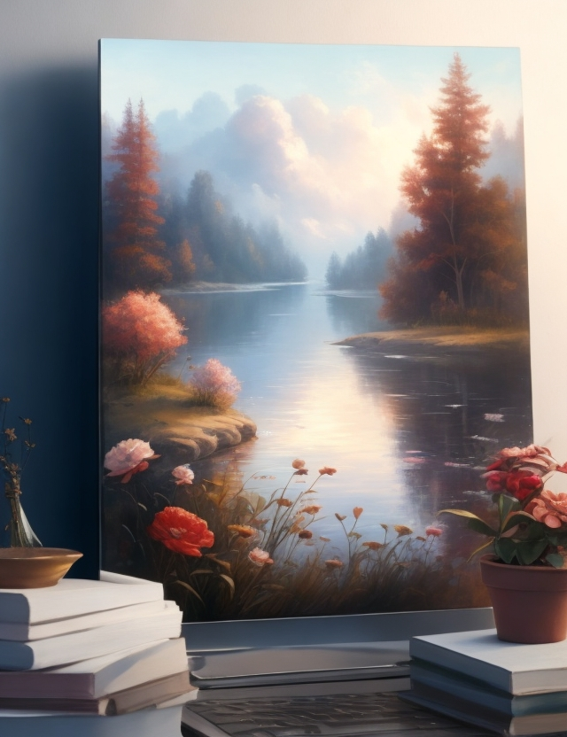

# Project Name 🎨
## Ecommerce Website for Artist

## Description 📜
This project is a website built using HTML and CSS with Tailwind as the framework. The inspiration for the project comes from [Art by Rodca](https://artbyrodca.com/). The website is an e-commerce platform for artists to display and sell their artworks.

## Requirements ⚙️
- Node.js

## Project Files 📂
The project consists of the following files/folders in its root directory:

- `index.html`: This file contains the homepage of the website.
- `package.json` and `package-lock.json`: These files contain metadata and information about the project dependencies respectively.
- `styles.css`: This file contains the configuration for Tailwind.
- `scripts.js`: This file contains scripts for the interactivity of the webpage.
- `server.js`: This file serves as a template for Node.js HTTP Server that handles requests for static files in the root directory.
- `tailwind.config.js`: This file contains the configurations for Tailwind.

## Installation 🚀
1. Clone the repository: `git clone https://github.com/nanagaisie1/wp-art-ecommerce.git`
2. Navigate to the project directory: `cd HTML-CSS`
3. Install the dependencies: `npm install`
4. Run the development command: `npm start` or `node server.js`
5. Open your browser and go to [http://localhost:3000/](http://localhost:3000/)

## Features ✨
- Homepage displaying latest artworks from artists 🖼️
- Navigation links to different categories of artworks available 🎨
- Contact page with a form for users to contact the website owners 📧
- Product pages with detailed information on each artwork and a button to add to the cart 🛒
- Cart page displaying items added to the cart with an option to checkout 🛍️

## Future Plans 🚀
- Implement login and authentication for artists and users 🔐
- Add a search functionality for artwork 🔍
- Integrate a payment gateway for online transactions 💳

## Conclusion 🌟
This e-commerce website for artists is a great platform for artists to display and sell their works. With its simple and intuitive user interface, users can easily navigate the site and find artworks they love. The project is open for contributions. Feel free to contribute and make it better. Let's celebrate art! 🎉